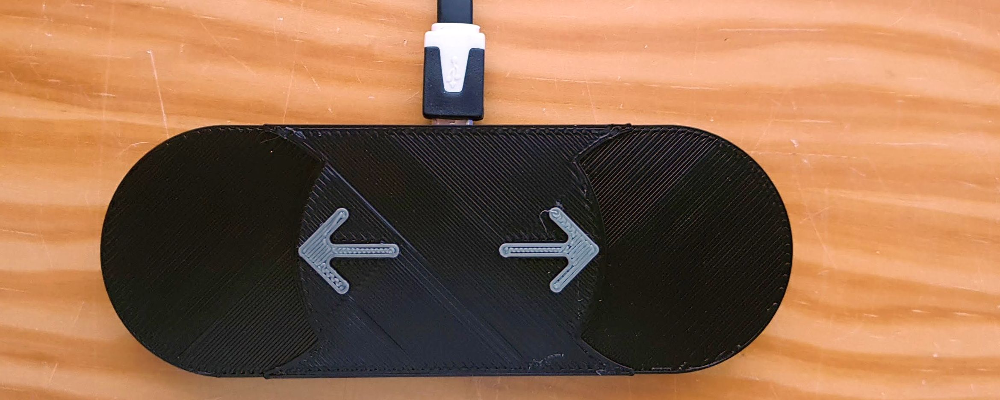

# HIDKeyboard
A small extra keyboard for a PC (or Raspberry Pi)

# Introduction
I was inspired by [Maker's Muse](https://www.youtube.com/watch?v=MeYuIWGqquE) to make my own private keyboard.
The first keyboard that I made was a "gaming" keyboard for my son, an extra "quick access" keyboard attached to his (game) PC.
Next project was two-key keyboard (PageUp and PageDown) for a Raspberry Pi showing a series of pages.

# Project 1 - Gaming keyboard
The first keyboard that I made was a "gaming" keyboard for my son.

## Project 1 - Hardware
I selected the following components:
 - [Arduino Pro Micro](https://www.aliexpress.com/item/Free-Shipping-New-Pro-Micro-for-arduino-ATmega32U4-5V-16MHz-Module-with-2-row-pin-header/1871481789.html)
 - [Keyboard switches](https://www.aliexpress.com/item/10Pcs-3-Pin-KeyCaps-Mechanical-Keyboard-Switch-Blue-for-Cherry-MX-Switches-Keyboard-Replacement-Tester-Kit/32884614611.html)
 - [Keyboard key caps](https://www.aliexpress.com/item/PBT-Keycaps-DSA-1u-Blank-Printed-Keycaps-For-Gaming-Mechanical-Keyboard-20pcs/32908275436.html)
 - Casing to be 3D printed. I used [inserts](https://www.aliexpress.com/item/CNIM-Hot-M2-x-3mm-Brass-Cylinder-Knurled-Threaded-Round-Insert-Embedded-Nuts-100pcs/32876609027.html) to fix the bottom to the top part of the casing
 - [USB HID software library from NicoHood](https://github.com/NicoHood/HID), which actually comes _with_ the Arduino IDE
 - The Arduino [application](ProMicroKbd)

## Project 1 - Software
The Arduino application is written by me in such a way that it should be easy to configure. 
The code is in [ProMicroKbd](ProMicroKbd). That is what this github project is about.

I am considering adding a virtual serial com port to the keyboard, 
so that the configuration can simply be written to the keyboard, meaning that a recompile is no longer needed.

## project 1 - Pictures

Bottom view with USB plug and bolts (that connect to [inserts](https://www.aliexpress.com/item/CNIM-Hot-M2-x-3mm-Brass-Cylinder-Knurled-Threaded-Round-Insert-Embedded-Nuts-100pcs/32876609027.html))

The Arduino pro micro inside

Top view, still without the key caps.

Final keyboard with the caps.

# Project 2 - NarrowCast keyboard
Half a year later, I made a [NarrowCast](https://github.com/maarten-pennings/NarrowCast) system: 
a screen in the coffee corner showing company news.
I noticed that people wanted to go back to a certain page to discuss that. 
So, I decided to add a two-key keyboard to the screen with keys for PageUp and PageDown.

## Project 2 - Hardware and software
The original [code](ProMicroKbd) needed some adaptations (as foreseen), resulting in [ProMicroKbd2](ProMicroKbd2).
I did have to make one unforeseen change: the button levels changed. The reason is that I used 
[capacitive touch sensor boards](https://www.aliexpress.com/item/Digital-capacitive-touch-sensor/32570170116.html), 
those boards give 1 (3V3) when pressed, not 0 (0V0) as the mechanical switches did.

## Project 2 - Pictures

The Arduino pro micro wired to two touch sensors.

The Arduino PCB top view.

The PCBs in the box.

Adding  [inserts](https://www.aliexpress.com/item/CNIM-Hot-M2-x-3mm-Brass-Cylinder-Knurled-Threaded-Round-Insert-Embedded-Nuts-100pcs/32876609027.html) in the box.

Securing the bottom with bolts.

Complete assembly, top view.

# Project 3 - Trying the Raspberry Pi RP2040 

Four years later, I gave the RP2040 a [try](rp2040try).

(end)
